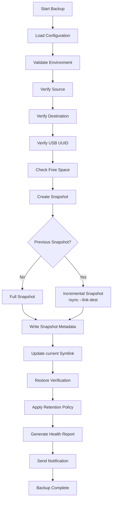

# Offsite Backup V2 for Proxmox VE

[](https://github.com/russo94/offsite-backup-v2/actions/workflows/shellcheck.yml)

A safe, modular, snapshot-based backup solution for **Proxmox Virtual Environment (VE)**.

This project started as a personal homelab backup script.

Like many people running Proxmox at home, I wanted something simple, reliable, and completely transparent. I did not want a backup system that felt like a black box or required proprietary formats to restore my data. I wanted something I could understand from top to bottom, audit whenever I wanted, and trust when I actually needed it.

Over time, that small script evolved into Offsite Backup V2.

Today it creates efficient incremental snapshots using `rsync` and hard links, verifies the backup environment before every run, records detailed snapshot metadata, performs restore verification, manages automatic retention, generates health reports, and can send notifications when backups complete.

The philosophy behind this project is simple:

> **A backup is only valuable if you trust that you can restore it.**

Rather than hiding data inside proprietary archives, every snapshot remains a normal directory that can be explored using standard Linux tools. If you know how to use `ls`, `cp`, and `rsync`, you already know how to browse and restore your backups.

---

## Status

Current version: v1.0.0

This project is actively used in a personal Proxmox homelab environment.

The current release includes:

- Incremental snapshot backups
- Retention management
- Restore verification
- Health reporting
- Discord notifications
- Systemd automation

---

## Who is this for?

Offsite Backup V2 is intended for people who:

- Run **Proxmox VE** at home or in a small lab.
- Prefer simple and transparent backup solutions.
- Want complete, browseable snapshots instead of proprietary backup archives.
- Like understanding how their backup system works.
- Enjoy learning from or extending open-source projects.

If you are looking for an enterprise backup platform with centralized management, this project probably is not the right fit.

If you are a homelab enthusiast who wants a backup solution you can fully understand, customize, and trust, then you are exactly who this project was built for.

---

## Features

- Incremental snapshots using `rsync --link-dest`
- Fully browseable snapshots
- Hard-link deduplication for efficient storage
- Snapshot metadata generation
- Daily, weekly, and monthly retention policies
- USB filesystem UUID validation
- Minimum free-space verification
- Restore verification
- Health reporting
- Automatic systemd scheduling
- Structured logging
- Discord success notifications
- Discord failure notifications
- Snapshot status tracking through the `current` symbolic link
- Modular Bash architecture
- ShellCheck-clean codebase

---

## Quick Start

Clone the repository:

```bash
git clone https://github.com/russo94/offsite-backup-v2.git
cd offsite-backup-v2
```

Create your configuration file:

```bash
cp backup.conf.example backup.conf
```

Edit the configuration:

```bash
nano backup.conf
```

At a minimum, configure:

- `SOURCE`
- `DESTINATION`
- `EXPECTED_UUID`

Run a syntax check:

```bash
bash -n offsite-backup-v2.sh

for file in lib/*.sh; do
    bash -n "$file" || exit 1
done
```

Run the backup:

```bash
./offsite-backup-v2.sh
```

Enable automatic backups with systemd:

```bash
systemctl enable offsite-backup-v2.timer
systemctl start offsite-backup-v2.timer
```

Verify the schedule:

```bash
systemctl list-timers | grep offsite
```

If everything is configured correctly, a new snapshot will be created and a `current` symbolic link will point to the latest successful backup.

> **Tip**
>
> Before enabling automatic deletion, leave `RETENTION_MODE="dry-run"` in `backup.conf`. This lets you verify which snapshots would be removed without deleting any data.

---

## Documentation

Detailed documentation is available in the `docs/` directory.

| Document | Description |
|----------|-------------|
| `installation.md` | Installation and initial setup |
| `configuration.md` | Configuration reference |
| `architecture.md` | Project architecture and module overview |
| `retention.md` | Snapshot retention strategy |
| `restore.md` | Restore procedures and verification |
| `systemd.md` | Running the backup automatically with systemd |

## Project Structure

The project is intentionally split into small, focused modules. Each script has a single responsibility, making the code easier to understand, maintain, and extend.

```text
offsite-backup-v2/
├── backup.conf.example      # Example configuration
├── offsite-backup-v2.sh     # Main backup orchestrator
├── README.md
├── docs/
│   ├── installation.md
│   ├── configuration.md
│   ├── architecture.md
│   ├── retention.md
│   ├── restore.md
│   └── systemd.md
└── lib/
    ├── health.sh
    ├── logging.sh
    ├── metadata.sh
    ├── notify.sh
    ├── restore_verify.sh
    ├── retention.sh
    ├── snapshot.sh
    └── util.sh
```

### Main Components

| Component | Purpose |
|-----------|---------|
| `offsite-backup-v2.sh` | Main entry point that coordinates the backup process. |
| `backup.conf` | User configuration for sources, destinations, retention, and notifications. |
| `lib/snapshot.sh` | Creates full and incremental snapshots using `rsync`. |
| `lib/retention.sh` | Applies daily, weekly, and monthly retention policies. |
| `lib/metadata.sh` | Records metadata for every snapshot. |
| `lib/logging.sh` | Provides structured logging functions. |
| `lib/health.sh` | Performs health and environment checks. |
| `lib/restore_verify.sh` | Validates that snapshots can be restored successfully. |
| `lib/notify.sh` | Sends backup notifications. |
| `lib/util.sh` | Shared helper functions used throughout the project. |

---

## How It Works



Every backup follows the same predictable workflow.

Before any data is copied, the backup environment is validated to reduce the risk of common mistakes. This includes verifying the backup destination, checking the expected USB UUID, ensuring sufficient free disk space, and confirming that the source directories exist.

Snapshots are created using `rsync` with `--link-dest`. The first backup is a full snapshot, while subsequent backups hard-link unchanged files from the previous snapshot. This significantly reduces storage usage while keeping every snapshot fully browseable.

Each successful backup records metadata describing when it was created, which host created it, the backup version, and other useful system information. A restore verification step then confirms that the snapshot can be accessed before retention policies are applied.

Finally, the backup system generates a health report and, if configured, sends a notification summarizing the backup.

---

## Snapshot Layout

Each backup is stored as its own directory.

```text
snapshots/
├── 2026-07-20_23-37-14/
│   ├── nginxproxymanager/
│   ├── pihole/
│   ├── vaultwarden/
│   ├── proxmox/
│   └── .snapshot-info
│
├── 2026-07-21_12-28-57/
│   ├── nginxproxymanager/
│   ├── pihole/
│   ├── vaultwarden/
│   ├── proxmox/
│   └── .snapshot-info
│
└── current -> 2026-07-22_11-26-41
```

Although unchanged files are shared using hard links, every snapshot behaves like a complete backup. This means you can browse, compare, or restore any snapshot independently without reconstructing incremental chains.

The `current` symbolic link is updated after every successful snapshot and always points to the latest verified backup. This allows quick access for restore operations and external monitoring tools.

---

## Disaster Recovery

A backup is only useful if it can be restored.

Offsite Backup V2 is designed around simple recovery using standard Linux tools. Snapshots are stored as normal directories and do not depend on proprietary backup formats.

### Scenario: Proxmox Host Failure

If the Proxmox host is lost:

1. Install Proxmox VE on replacement hardware.
2. Connect the backup storage device.
3. Mount the backup destination.
4. Verify available snapshots.
5. Restore required services from the latest valid snapshot.
6. Start services and verify functionality.

Example recovery workflow:

```bash
ls /mnt/offsite-backup/snapshots

readlink -f /mnt/offsite-backup/current
```

A snapshot can be restored using standard tools such as `rsync`.

Example:

```bash
rsync -aHAX --numeric-ids \
    /mnt/offsite-backup/current/ \
    /restore/location/
```

### Recovery Philosophy

Offsite Backup V2 intentionally avoids hiding data inside proprietary archives.

Each snapshot remains:

- Browseable
- Portable
- Verifiable
- Restorable with standard Linux tools

The goal is that recovery should still be possible even if the original backup software is unavailable.

---

## Roadmap

Offsite Backup V2 is actively developed as part of my homelab. While it is already stable enough for daily use, there are several ideas planned for future releases.

### Planned Features

- Encrypted backup support
- Remote replication to a second backup destination
- Backup integrity verification
- SMART health monitoring
- Email notifications
- Additional notification providers
- Automatic restore testing
- Expanded documentation
- CI pipeline with automated ShellCheck and testing

Suggestions and feature requests are always welcome.

---

## Contributing

Contributions of all sizes are welcome.

Whether you want to:

- Report a bug
- Suggest a new feature
- Improve the documentation
- Fix a typo
- Submit code improvements

please feel free to open an issue or submit a pull request.

If you contribute code, try to keep it consistent with the rest of the project:

- Keep modules focused on a single responsibility.
- Write clear, readable Bash.
- Run ShellCheck before submitting changes.
- Prefer safety over cleverness.
- Document new features when appropriate.

---

## License

This project is licensed under the MIT License.

See the `LICENSE` file for details.

---

## About

Offsite Backup V2 began as a small personal backup script for my own Proxmox homelab.

As the project grew, I decided to refactor it into a modular, documented, and open-source backup solution that others could learn from, adapt, and improve.

While it may not have every feature found in enterprise backup software, every design decision has been made with reliability, transparency, and recoverability in mind.

If this project helps you protect your homelab, then it has achieved exactly what it was created for.

⭐ If you find the project useful, consider starring the repository. It helps others discover it and motivates continued development.
